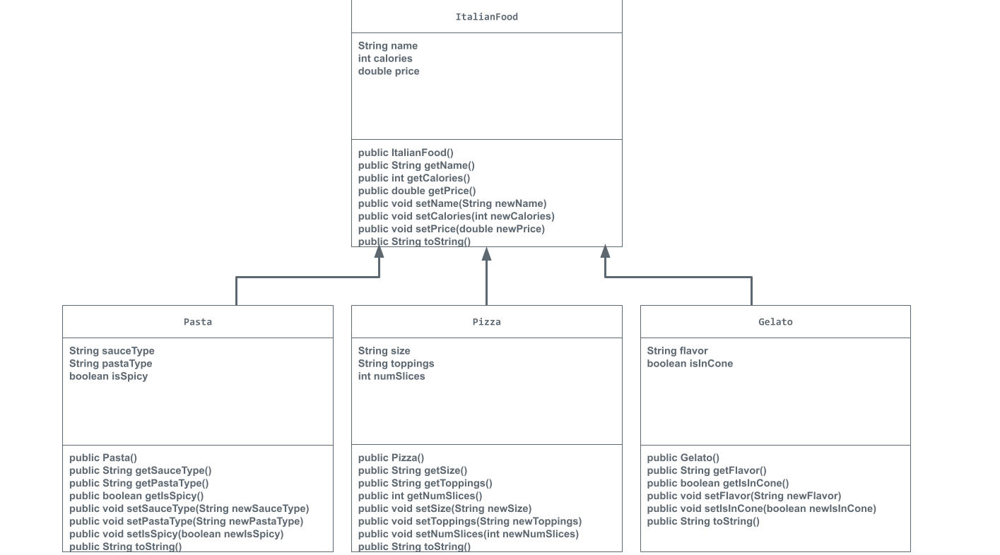

# Unit 2 - Store Management Project

## Introduction

You are opening a new business in your community! Businesses often need programs to manage the products and services they offer and track orders and requests from customers. Your goal is to create a store management system for your business.

## Requirements

Use your knowledge of object-oriented programming and class structure and design to create your store management system:
- **Create a class hierarchy** – Develop a superclass that represents a product or service your business offers and one or more subclasses that extend the superclass to represent more specific types of products or services.
- **Declare instance variables** – Declare instance variables in the superclass that are shared with the subclasses and instance variables in the subclasses that are not shared with the superclass.
- **Write constructors** – Write no-argument and parameterized constructors in the superclass and subclasses. Subclass constructors use the super keyword to call the superclass constructor.
- **Implement accessor and mutator methods** – Write accessor and mutator methods for instance variables that should be accessible and/or modifiable from outside of the class.
- **Implement a toString() method** – Write toString() methods in the superclass and subclasses that return information about the state of an object.

## UML Diagram

Put and image of your UML Diagram here. Upload the image of your UML Diagram to your repository, then use the Markdown syntax to insert your image here.

## Description

For this project, I decided to create an Italian Restaurant. I knew I wanted to create a restaurant because I dream of becoming a chef when I'm older, and an Italian Restaurant is the first thing to come into my mind. To represent my assorted objects, I used no-argument constructors, parameterized constructors, accessor methods, mutator methods, and toString() methods. The Pasta, Pizza, and Gelato classes are all subclasses of the ItalianFood class, and thus each inherited the name, calories, and price instance variables from ItalianFood. They also overrode ItalianFood's toString() method as a component of their respective toString() methods to express all their attributes. Not to mention, each class has two different versions of their respective parameterized constructors with one of them having all the variables, whule the other has some of the variables set as their default value. Different subclasses also required new instance variables of varying primitive data types and reference types. For example, Pasta required two String variables to express its sauce and pasta shape along with a boolean expression to represent if it has spice or not. On the other hand, Pizza also had two String variables for its size and topping(s), but also had an int for the number of slices. All together, these variables and methods built the different food classes I serve at my restaurant and were all tested to prove that they worked as intended, all of which (tests) were passed.
